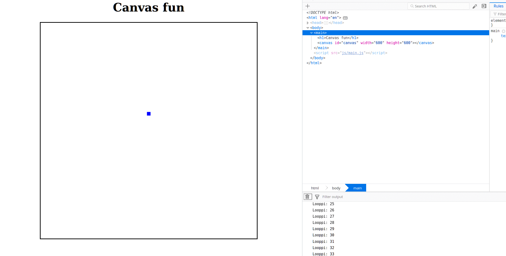

# Canvas basics
- Creating a canvas
- Running basic JS stuff from different file
- Drawing something to a canvas
- Moving something in a canvas
- For loops and variables
- Preparations for a snake-like game

